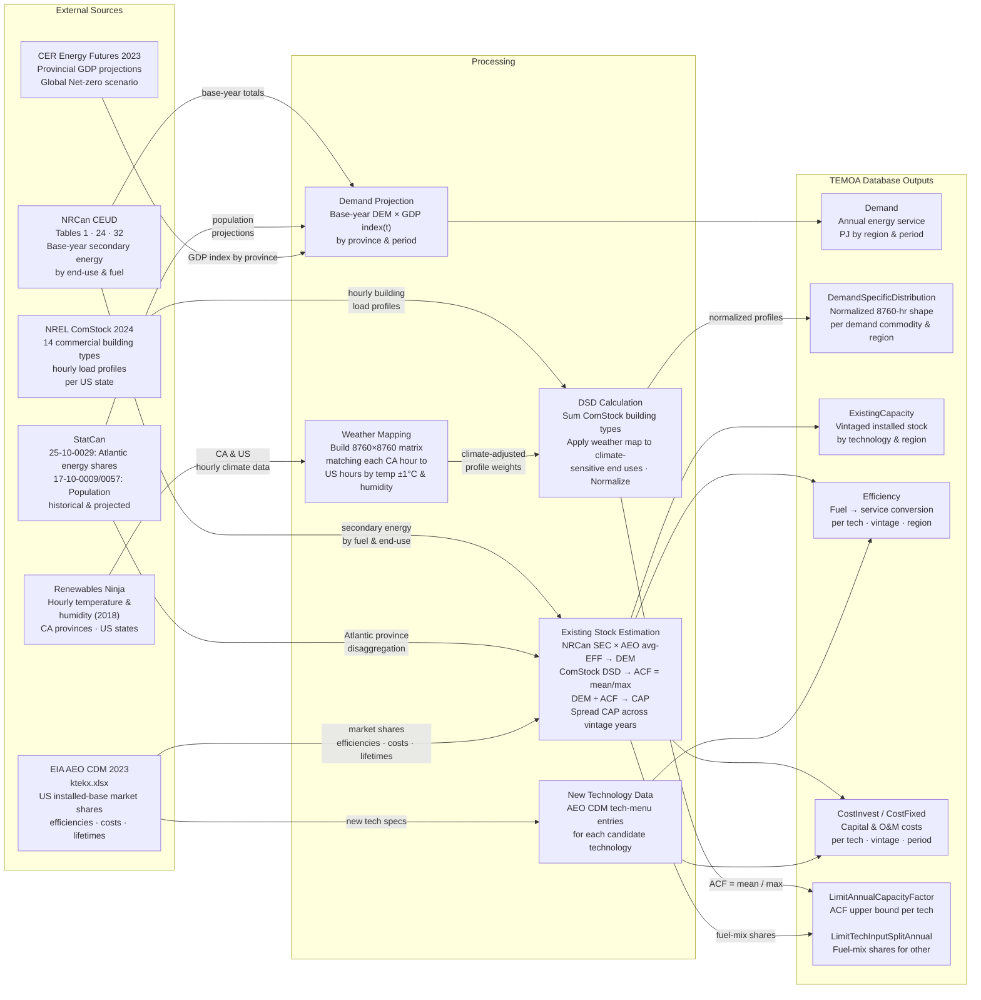
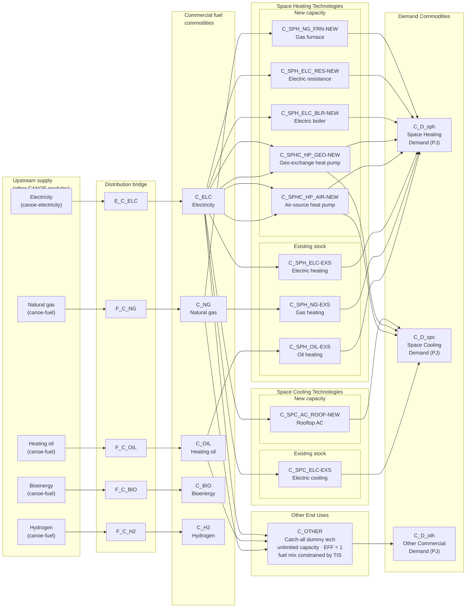
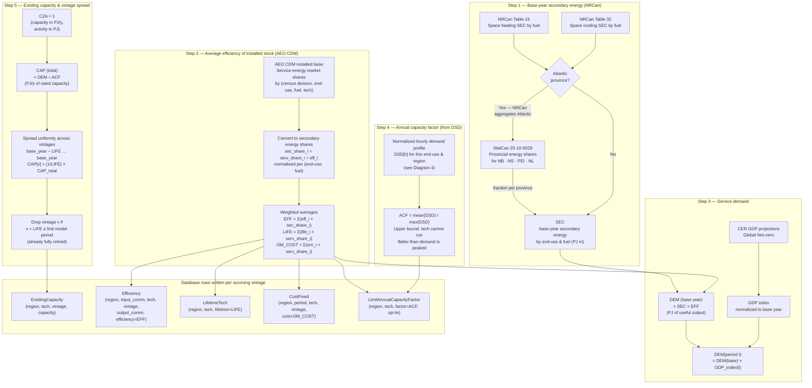
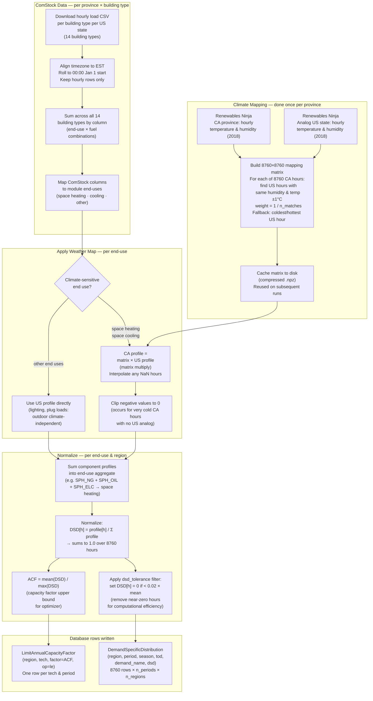
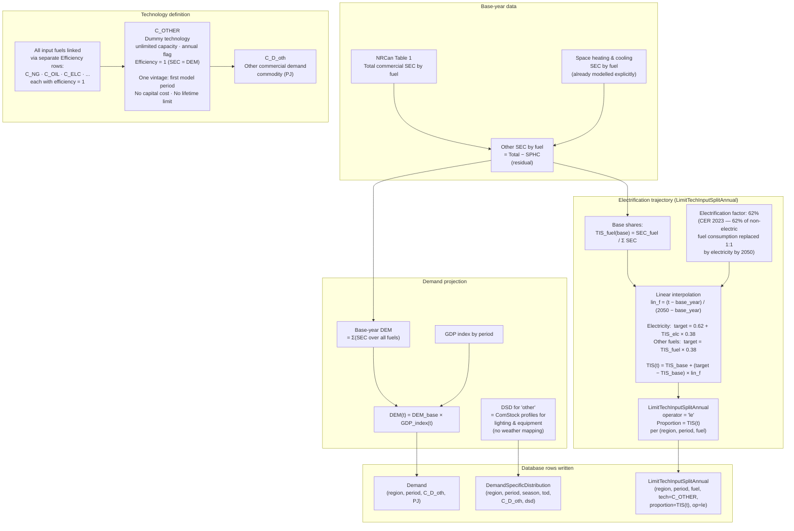

# canoe-commercial: Module Diagrams

---

## 1. Overall Module Pipeline

Data flows left-to-right from external sources through the module's processing steps to the TEMOA database tables that downstream optimization reads.

---

## 2. Energy System Structure

The commodity-technology-demand network as TEMOA sees it. Fuel commodities (left) are converted by end-use technologies (centre) into energy services that must meet the imposed demands (right). Existing and new technologies are distinguished; distribution techs bridge from upstream supply modules.

---

## 3. Existing Stock Calculation

The module cannot directly observe what equipment is installed in Canadian commercial buildings. It reconstructs existing capacity by combining Canadian energy consumption data (NRCan) with US market-share and efficiency data (AEO CDM). The chain below is applied independently for each `(region, end-use, fuel)` combination.

---

## 4. Within-Year Demand Shaping (DSD Derivation)

TEMOA requires a normalized hourly demand profile (DemandSpecificDistribution) to know *when* within the year each demand must be met. Because no Canadian equivalent of ComStock exists, profiles are derived from US building data re-mapped to Canadian climate conditions.

---

## 5. "Other" End Uses — Treatment and Electrification Trajectory

All commercial energy consumption that is not space heating or space cooling (lighting, water heating, refrigeration, cooking, plug loads, etc.) is modelled as a single catch-all commodity served by a single unlimited-capacity technology. The optimizer has no technology choice here; instead, the fuel mix is constrained exogenously by a parameterized electrification trajectory.

